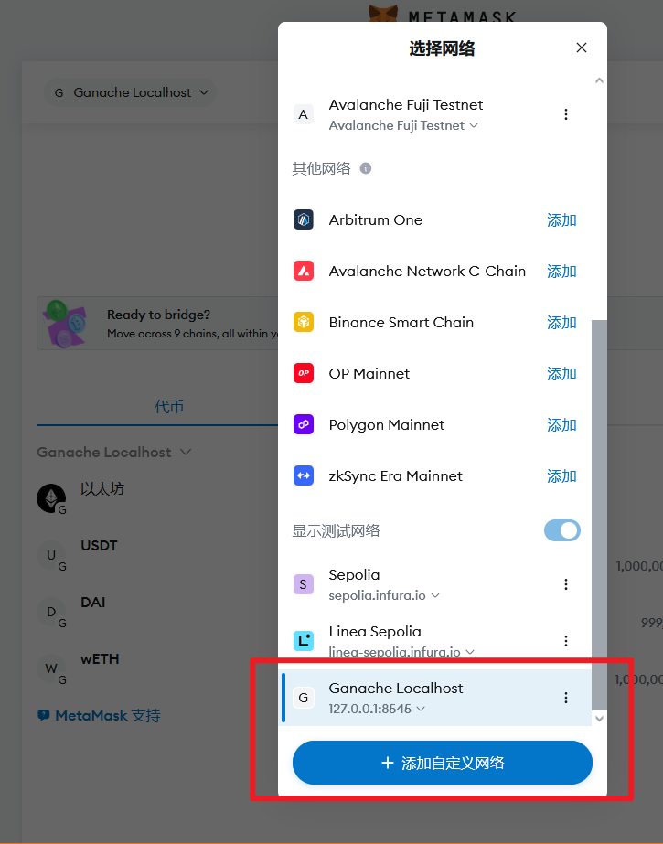
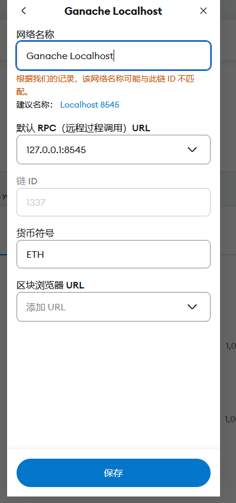
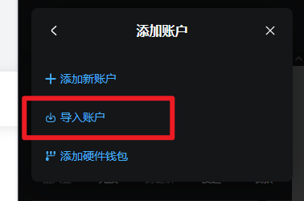
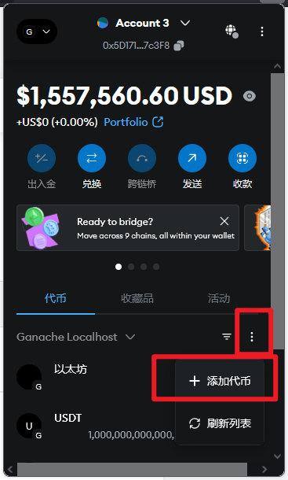

# 初始化


### 1 项目结构

项目目录如下：

```
my-token-project/
├── contracts/           # 存放智能合约（.sol 文件）
├── scripts/            # 部署脚本（如 deploy.ts）
├── test/               # 测试文件
├── hardhat.config.ts   # Hardhat 配置文件
└── package.json
```

### 2. 安装依赖

```
nvm install 
```


👇👇👇👇👇👇👇

### **3. 启动网络**

#### **3.1 启动 Ganache **

```
ganache-cli --db ./ganache-data --mnemonic "labor security egg caught skull labor coyote tennis avoid annual glove rookie"

```


#### **3.2 部署合约（如果需要）**

新终端窗口运行合约部署代码：

```
npx hardhat run scripts/deploy_contracts.js --network ganache


#测试
npx hardhat run scripts/test.js --network ganache

#单独部署池子
npx hardhat run scripts/deploy_pools.js --network ganache

```

合约地址保存在

```
scripts/deployed_contracts.json 
```

本地控制台

```
npx hardhat console --network ganache
```


### **4. Metamask 连接**

#### **4.1 添加 Ganache网络 **

添加本地Ganache网络






#### **4.2 添加账户 **

复制密钥，添加测试账户



#### **4.3 添加代币**

输入代币部署地址即可添加代币


